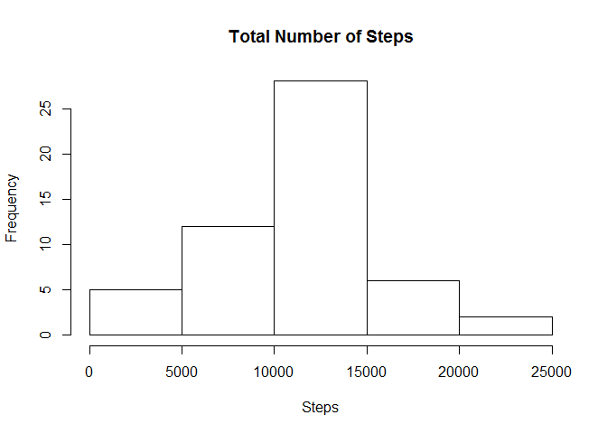
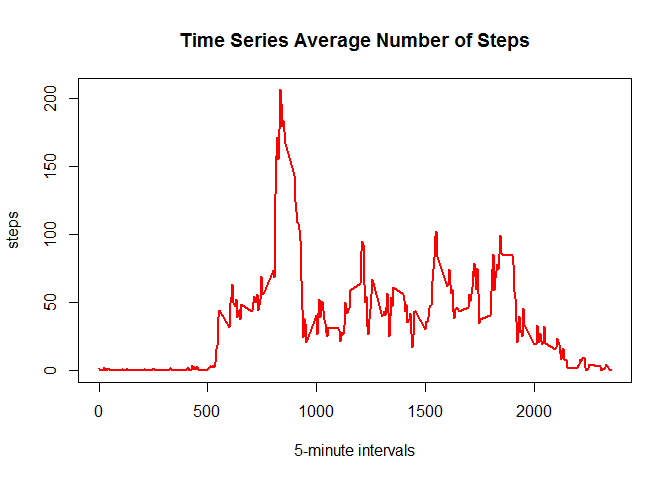
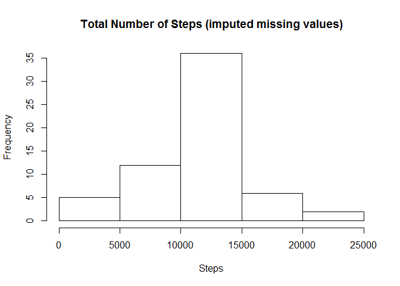
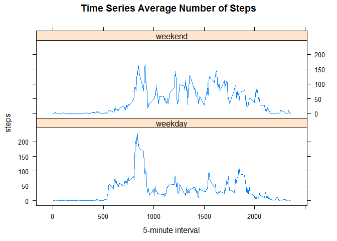

# RepData Peer Assessment 1
Thomas Bell  
7/27/2017  

# Activity Monitoring


## Loading and preprocessing the data

The following code is used to read the activity data into the memory of R. The zip archive **activity.zip** contains one file **activity.csv**. By calling the function unzip() from read.csv the text file is directly read from the archive and stored in a variable called *data*. With the function mutate() from the dplyr package the dates are converted into a Date-class in R.


```r
library(dplyr)

data <- read.csv(unzip("activity.zip"))
data <- mutate(data, date = as.Date(date))
```

## What is mean total number of steps taken per day?

The following code chunk plots a histogram of the total number of steps per day using the Base plotting system. Followed by a calculation of the mean and median of the total number of steps taken per day. In this part of the assignment missing values in the data set are ignored.

1. Make a histogram of the total number of steps taken each day


```r
aggr_days <- aggregate(steps ~ date, data = data, sum)
hist(aggr_days$steps, main = "Total Number of Steps", xlab = "Steps")
```

<!-- -->

```r
act_mean <- format(mean(aggr_days$steps), scientific = FALSE)
act_median <- median(aggr_days$steps)
```

2. Calculate and report the **mean** and **median** total number of steps taken per day

The mean of the total number of steps taken per day is **10766.19**

The median of the total number of steps taken per day is **10765**


## What is the average daily activity pattern?

1. Make a time series plot (i.e. `type = "l"`) of the 5-minute interval (x-axis) and the average number of steps taken, averaged across all days (y-axis)


```r
aggr_interval <- aggregate(steps ~ interval, data = data, mean)
with(aggr_interval, plot(interval, steps, type = "l", lwd = 2, col = "red", main = "Time Series Average Number of Steps", xlab = "5-minute intervals"))
```

<!-- -->

```r
max_interval <- aggr_interval[which.max(aggr_interval$steps),]
```

2. Which 5-minute interval, on average across all the days in the dataset, contains the maximum number of steps?

The 5-minute interval of **835** contains the maximum number of steps, which is **206.1698113**

## Imputing missing values

Note that there are a number of days/intervals where there are missing
values (coded as `NA`). The presence of missing days may introduce
bias into some calculations or summaries of the data.


```r
misvalues <- sum(is.na(data$steps))
```

1. Calculate and report the total number of missing values in the dataset (i.e. the total number of rows with `NA`s)

The total number of missing values in the dataset is **2304**

2. Devise a strategy for filling in all of the missing values in the dataset. The strategy does not need to be sophisticated. For example, you could use the mean/median for that day, or the mean for that 5-minute interval, etc.

The original data frame is left joined with the aggregated data frame of the previous question based on the *interval* number. The joined data frame is mutated to replace the NAs in the *steps* column with the average steps in the column which was joined. After this operation the joined column is dropped so that a single *steps* column remains, containing either actual observations or average measurements for an *interval* on a certain date.

3. Create a new dataset that is equal to the original dataset but with the missing data filled in.


```r
library(dplyr)
data %>% left_join(aggr_interval, by = c("interval", "interval")) %>% mutate(steps.x = as.double(steps.x)) %>% mutate(steps.x = if_else(is.na(steps.x), steps.y, steps.x)) %>% select(-steps.y) %>% rename(steps = steps.x)-> data_imputed
```

4. Make a histogram of the total number of steps taken each day and Calculate and report the **mean** and **median** total number of steps taken per day. Do these values differ from the estimates from the first part of the assignment? What is the impact of imputing missing data on the estimates of the total daily number of steps?


```r
aggr_days_imp <- aggregate(steps ~ date, data = data_imputed, sum)
hist(aggr_days_imp$steps, main = "Total Number of Steps (imputed missing values)", xlab = "Steps")
```

<!-- -->

```r
act_mean_imp <- format(mean(aggr_days_imp$steps), scientific = FALSE)
act_median_imp <- format(median(aggr_days_imp$steps), scientific = FALSE)
```

The mean of the total number of steps taken per day (with imputed missing values) is **10766.19**

The median of the total number of steps taken per day (with imputed missing values) is **10766.19**


## Are there differences in activity patterns between weekdays and weekends?

For this part the `weekdays()` function may be of some help here. Use
the dataset with the filled-in missing values for this part.

1. Create a new factor variable in the dataset with two levels -- "weekday" and "weekend" indicating whether a given date is a weekday or weekend day.


```r
library(dplyr)
data_imputed %>% mutate(day = as.POSIXlt(data_imputed$date)$wday) %>% mutate(day = ifelse(day %in% 1:5, "weekday", "weekend")) %>% mutate(day = factor(.$day, c("weekday","weekend"))) -> data_imp_days
```

1. Make a panel plot containing a time series plot (i.e. `type = "l"`) of the 5-minute interval (x-axis) and the average number of steps taken, averaged across all weekday days or weekend days (y-axis). 

For lack of a better method, weekend and weekdays are first subsetted. For both subsets an aggregate table is created with the average number of steps per interval. With cbind/rbind it is merged back into one single data set in order to create a panel plot with the Lattice system.


```r
aggr_weekday <- aggregate(steps ~ interval, data = subset(data_imp_days, day == "weekday"), mean)
aggr_weekday <- cbind(aggr_weekday, day = "weekday")
aggr_weekend <- aggregate(steps ~ interval, data = subset(data_imp_days, day == "weekend"), mean)
aggr_weekend <- cbind(aggr_weekend, day = "weekend")
aggr_both <- rbind(aggr_weekday, aggr_weekend)

library(lattice)
attach(aggr_both)
xyplot(steps~interval|day, type = "l", layout = c(1,2), xlab = "5-minute interval", main = "Time Series Average Number of Steps")
```

<!-- -->
